# Conversation Prompts - Reconciliation 360 dbt Project

## Prompt 1: Project Setup
```
Please set up a proper empty DBT project using dbt skill in my coco_demo repo please can you do that?
```

## Prompt 2: Database Change & Data Model Context
```
Okay I do want to change this slightly and I want to work I want to use COCO_LIVE_DB 

I believe that this is the data model 

# Reconciliation Management System - Data Model

## Overview

This is a **Financial Reconciliation Management System** designed for enterprise account reconciliation, certification workflows, and variance analysis. The system manages the full lifecycle of financial reconciliations across multiple organizational entities, periods, and currencies.

## Domain Description

### Purpose
The system enables organizations to:
- **Reconcile accounts** - Match and verify financial balances across systems
- **Certify periods** - Track sign-off workflows for financial close
- **Analyze variances** - Identify and explain differences between expected and actual values
- **Manage hierarchies** - Support multi-entity consolidation and reporting

### Key Business Processes
1. **Period Management** - Define reconciliation periods (monthly, quarterly, annual)
2. **Assignment Workflow** - Assign reconciliations to users with role-based access
3. **Item Tracking** - Track individual line items and their reconciliation status
4. **Certification** - Multi-level approval and certification workflows
5. **Variance Analysis** - Track and explain variances over time
6. **Consolidation** - Roll up results across organizational hierarchies

---

## Entity Relationship Diagram

```mermaid
erDiagram
    %% Core Organizational Entities
    ORG_SETTINGS ||--o{ ORG_ENTITIES : configures
    ORG_ENTITIES ||--o{ ORG_ENTITY_RELATIONSHIPS : has
    ORG_ENTITIES ||--o{ ENTITIES_CONSOLIDATION_METHODS : uses
    ORG_ENTITIES ||--o{ ORG_TEAM_RELATIONSHIPS : belongs_to
    
    %% Financial Statement Structure
    ORG_FINANCIAL_STATEMENT_TYPES ||--o{ ORG_FINANCIAL_STATEMENTS : categorizes
    ORG_FINANCIAL_STATEMENTS ||--o{ ORG_FINANCIAL_STATEMENT_RELATIONSHIPS : relates_to
    
    %% Period and Assignment Core
    REC_PERIODS ||--o{ REC_PERIOD_INFORMATION : contains
    REC_PERIODS ||--o{ REC_RECONCILIATIONS : belongs_to
    REC_PERIODS ||--o{ ASSIGNMENT_LINK_PERIOD : links
    REC_PERIODS ||--o{ CERT_STATUS_PERIOD : tracks
    
    %% Reconciliation Workflow
    REC_ASSIGNMENTS ||--o{ REC_RECONCILIATIONS : manages
    REC_ASSIGNMENTS ||--o{ REC_ASSIGNMENTS_ROLES : has
    REC_ASSIGNMENTS ||--o{ REC_GROUP_ASSIGNMENTS : grouped_in
    REC_ASSIGNMENTS ||--o{ REC_ITEM_ASSIGNMENTS : contains
    
    %% Items and Details
    REC_ITEMS ||--o{ REC_ITEM_ASSIGNMENTS : assigned_to
    REC_ITEMS ||--o{ REC_ITEMS_BASE_AMOUNTS : has_amounts
    REC_RECONCILIATIONS ||--o{ COMMENT_DETAILS : has
    COMMENT_DETAILS ||--o{ COMMENT_RECONCILIATION : links
    
    %% Variance Analysis
    VAR_FREQUENCIES ||--o{ VAR_ACTIVITY : schedules
    VAR_RULE_DEFINITION ||--o{ VAR_ACTIVITY : governs
    REC_ASSIGNMENTS ||--o{ VAR_ACTIVITY : tracks
    REC_ASSIGNMENTS ||--o{ VAR_GROUP_MAPPING : maps
    
    %% Certification Workflow
    CERT_STATUS_TYPES ||--o{ CERT_STATUS_DETAILS : defines
    CERT_STATUS_TYPES ||--o{ CERT_STATUS_PERIOD : tracks
    
    %% Consolidation
    CONSOLIDATION_METHOD_RULES ||--o{ ENTITIES_CONSOLIDATION_METHODS : applies
    CONSOLIDATION_METHOD_RULES ||--o{ CONSOLIDATION_LINK_PERIOD : uses
    
    %% Reference Data
    OS_CURRENCIES ||--o{ REC_CURRENCY_RATES_RT : exchanges
    REC_RATE_TYPES ||--o{ REC_CURRENCY_RATES_RT : categorizes
    USERS ||--o{ REC_ASSIGNMENTS_ROLES : assigned_to
    USERS_DEFINED_ROLES ||--o{ REC_ASSIGNMENTS_ROLES : defines
```



---

## Table Descriptions

### Core Organization (ORG_*)

| Table | Rows | Description |
|-------|------|-------------|
| `org_settings` | 2 | Global organization configuration parameters |
| `org_entities` | 650 | Organization units (companies, cost centers, departments) |
| `org_entity_relationships` | 100 | Parent-child and affiliate relationships between entities |
| `org_team_relationships` | 50 | Team membership and reporting relationships |
| `org_related_type` | 5 | Reference: types of relationships (Parent, Sibling, etc.) |
| `org_account_combinations` | 5 | Account segment configuration for GL structure |
| `org_financial_statements` | 20 | Financial statement definitions (Balance Sheet, P&L, etc.) |
| `org_financial_statement_types` | 4 | Categories of financial statements |
| `org_financial_statement_relationships` | 20 | Links between related financial statements |

### Reconciliation Core (REC_*)

| Table | Rows | Description |
|-------|------|-------------|
| `rec_periods` | 48 | Reconciliation periods (4 years × 12 months) |
| `rec_period_information` | 1.76M | Period-level metadata and status for each assignment |
| `rec_assignments` | 32,500 | Reconciliation assignments to accounts/entities |
| `rec_reconciliations` | 576K | Individual reconciliation records |
| `rec_items` | 2.5M | Line items within reconciliations |
| `rec_item_assignments` | 400K | Assignment of items to reconciliations |
| `rec_items_base_amounts` | 497 | Multi-currency base amounts for items |
| `rec_documents` | 50 | Supporting document references |
| `rec_currency_rates_rt` | 12.7K | Real-time currency exchange rates |
| `rec_rate_types` | 19 | Types of exchange rates (spot, average, etc.) |

### Assignment Workflow

| Table | Rows | Description |
|-------|------|-------------|
| `rec_assignments_roles` | 200 | User role assignments (preparer, reviewer, approver) |
| `rec_group_assignments` | 150 | Group-based assignment mappings |
| `assignment_link_period` | 198 | Links assignments to specific periods |

### Certification (CERT_*)

| Table | Rows | Description |
|-------|------|-------------|
| `cert_status_types` | 20 | Certification status definitions (Draft, Submitted, Approved) |
| `cert_status_details` | 50 | Detailed certification status with reasons |
| `cert_status_period` | 100 | Certification status by period and assignment |

### Variance Analysis (VAR_*)

| Table | Rows | Description |
|-------|------|-------------|
| `var_activity` | 183K | Variance tracking and history |
| `var_frequencies` | 4 | Variance calculation frequencies (Daily, Weekly, Monthly) |
| `var_rule_definition` | 10 | Rules for variance calculations and thresholds |
| `var_group_mapping` | 100 | Maps related assignments for variance comparison |

### Consolidation

| Table | Rows | Description |
|-------|------|-------------|
| `consolidation_method_rules` | 5 | Consolidation methods (Full, Proportional, Equity) |
| `consolidation_link_period` | 100 | Period-specific consolidation configurations |
| `entities_consolidation_methods` | 100 | Entity-level consolidation method assignments |

### Users & Comments

| Table | Rows | Description |
|-------|------|-------------|
| `users` | 10.2K | System users |
| `users_defined_roles` | 5 | Custom role definitions |
| `comment_details` | 25.9K | Comments and notes on reconciliations |
| `comment_reconciliation` | 200 | Links comments to specific reconciliations |

### Reference Data

| Table | Rows | Description |
|-------|------|-------------|
| `os_currencies` | 11 | Supported currencies (USD, EUR, GBP, etc.) |

---

## Data Volume Summary

| Category | Tables | Total Rows |
|----------|--------|------------|
| Reconciliation Items | 4 | 5.2M |
| Variance & Activity | 4 | 183K |
| Assignments & Workflow | 6 | 33K |
| Organization | 9 | 880 |
| Certification | 3 | 170 |
| Reference Data | 5 | 55 |
| **Total** | **38** | **~5.5M** |

---

## Key Relationships

### Reconciliation Flow
```
rec_periods → rec_assignments → rec_reconciliations → rec_items
                    ↓
            rec_item_assignments
                    ↓
            rec_items_base_amounts
```

### Certification Flow
```
cert_status_types → cert_status_details
        ↓
cert_status_period ← rec_assignments ← users
```

### Variance Analysis Flow
```
var_rule_definition → var_activity ← rec_assignments
        ↓                    ↓
var_frequencies      var_group_mapping
```

### Organization Hierarchy
```
org_settings → org_entities → org_entity_relationships
                    ↓
        entities_consolidation_methods
                    ↓
        consolidation_method_rules
```

---

## Use Cases for Analytics

1. **Reconciliation Status Dashboard** - Track completion rates by period, entity, assignee
2. **Aging Analysis** - Identify overdue reconciliations
3. **Variance Trending** - Analyze variance patterns over time
4. **Certification Compliance** - Monitor sign-off completion rates
5. **Workload Distribution** - Balance assignments across team members
6. **Currency Impact Analysis** - Assess FX impact on reconciliations
7. **Entity Consolidation** - Roll up results across hierarchies


I want to create a DBT model that create a customer 360 view of this can you help me do this and create semantic views that can help me talk to my data when I create an agent later on? 

Also swich to ACCOUNTADMIN as the role for now please
```

## Prompt 3: Exploration Queries Request
```
Can you create a .sql that is helpful queries for this data model for someone trying to get an understanding of what just created?
```

## Prompt 4: Privilege Error
```
CREATE DBT PROJECT "DBAPI_REPLICA_DB"."DBT_PROJECTS"."COCO_DBT_PROJECT_TEST" FROM $$snow://workspace/USER$JDEMLOW.PUBLIC."coco_demo"/versions/live/coco_demo$$ DEFAULT_TARGET = 'dev' DBT_VERSION = '1.9.4'

Error: SQL access control error:
Insufficient privileges to operate on schema 'DBT_PROJECTS'.

When I try to use the UI?
```

## Prompt 5: Semantic View Correction
```
I think one think I can see wrong is that we didn't use the semantic view syntax and we don't have the package maybe from snowflake labs that supports semantic views inside of dbt while the semantic model is great this isn't quick correct
```

## Prompt 6: Skill Usage Suggestion
```
If you are struggling make sure you invoke the dbt skill and the semantic skill to help you get there as you have if you need to do any optimizations here this sounds amazing thank you
```

## Prompt 7: Notebook
```
Can we make a notebook and show awesome graphic and show casing what in in the dbt model it self make sure you are using plotly as this works the best for snowflake notebooks if you plan on making charts of this
```

## Prompt 8: Documentation Request
```
Can you put in a .md all the prompts I have sent you in this thread
```

````

1. Anomaly Detection (High Value)

Detect unusual variances before they become problems
Flag reconciliations that deviate from historical patterns
Use: Isolation Forest, Autoencoders, or Snowflake's built-in DETECT_ANOMALIES
2. Variance Prediction (Forecasting)

Predict next period's variance amounts per entity
Help finance teams prepare for month-end close
Use: Time series forecasting (ARIMA, Prophet, or Snowflake ML FORECAST)
3. Risk Classification (Improve existing logic)

Replace rule-based risk levels with ML classification
Learn from historical patterns which entities become problematic
Use: XGBoost, Random Forest classification
4. Reconciliation Time-to-Close

Predict which reconciliations will be delayed
Prioritize workload for the team
Use: Regression or survival analysis
5. Root Cause Clustering

Group similar variance patterns to identify systemic issues
Use: K-Means, DBSCAN clustering on variance features
6. Entity Similarity / Peer Analysis

Find entities with similar reconciliation behavior
Benchmark performance against peers
Use: Embedding models + similarity search
Best starting point? Anomaly detection on VAR_ACTIVITY - it's high value, relatively simple, and Snowflake has native support via Cortex ML functions.

Want me to sketch out what that would look like?

```


createa  stremlit app

```
# Reconciliation 360 - dbt Project

A dbt project for the **Financial Reconciliation Management System** that creates comprehensive entity-level 360 views for reconciliation analysis, variance tracking, and compliance monitoring.

## Overview

This project transforms raw reconciliation data from PostgreSQL CDC replication into analytics-ready mart tables with a semantic model for natural language querying via Cortex Agent.

## Data Architecture

```
Source (DBAPI_REPLICA_DB.CUSTOMER_A_DATA)
    │
    ├── rec_periods
    ├── rec_assignments  
    ├── rec_reconciliations
    ├── rec_period_information
    ├── org_entities
    ├── users
    └── var_activity
    │
    ▼
Staging Layer (PUBLIC schema - views)
    │
    ├── stg_rec_periods
    ├── stg_rec_assignments
    ├── stg_rec_reconciliations
    ├── stg_rec_period_information
    ├── stg_org_entities
    ├── stg_users
    └── stg_var_activity
    │
    ▼
Intermediate Layer (PUBLIC schema - views)
    │
    ├── int_reconciliation_details
    └── int_variance_analysis
    │
    ▼
Marts Layer (PUBLIC_MARTS schema - tables)
    │
    ├── entity_360          ← Entity-level 360 view
    └── reconciliation_fact ← Detailed reconciliation records
```

## Mart Tables

### `entity_360`
Entity-level 360 view providing comprehensive reconciliation metrics per organization entity per period.

| Column | Description |
|--------|-------------|
| `entity_id`, `entity_code`, `entity_name` | Entity identifiers |
| `period_id`, `period_year`, `period_quarter`, `period_month_num` | Time dimensions |
| `total_assignments`, `active_assignments` | Assignment counts |
| `total_gl_balance`, `total_bank_balance`, `total_subledger_balance` | Balance summaries |
| `total_variance`, `total_absolute_variance`, `variance_count` | Variance metrics |
| `variance_risk_level` | Risk classification (High/Medium/Low/None) |

### `reconciliation_fact`
Detailed fact table for individual reconciliations with full context.

| Column | Description |
|--------|-------------|
| `reconciliation_id`, `assignment_id` | Record identifiers |
| `entity_name`, `entity_code`, `entity_parent_name` | Entity context |
| `account_combination`, `currency`, `segment1-5` | Account details |
| `balance_bank`, `balance_calculated`, `balance_subledger` | Balance values |
| `bank_calc_diff`, `bank_subledger_diff` | Calculated differences |
| `reconciliation_status` | Status (Reconciled/Minor Difference/Needs Review) |

## Semantic Model

Located at `models/semantic/reconciliation_360.yaml`, this semantic model enables natural language queries via Cortex Analyst/Agent.

**Sample questions it can answer:**
- "Which entities have high variance risk?"
- "What is the reconciliation status breakdown?"
- "Show me the monthly variance trend"
- "Which entities have the largest variances?"

## Configuration

### profiles.yml
```yaml
coco_demo:
  target: dev
  outputs:
    dev:
      type: snowflake
      account: trb65519
      user: JDEMLOW
      role: ACCOUNTADMIN
      database: DBAPI_REPLICA_DB
      warehouse: SNOW_INTELLIGENCE_DEMO_WH
      schema: PUBLIC
      threads: 4
```

## Usage

### Run all models
```bash
dbt run --project-dir /coco_demo
```

### Run tests
```bash
dbt test --project-dir /coco_demo
```

### Compile only (validate SQL)
```bash
dbt compile --project-dir /coco_demo
```

### Run specific model
```bash
dbt run --select entity_360 --project-dir /coco_demo
```

## Exploration

See `explore_data_model.sql` for helpful queries to understand the data, including:
- Data overview and sample queries
- Risk distribution analysis
- Reconciliation status breakdown
- Trend analysis
- Data quality checks

## Project Structure

```
coco_demo/
├── dbt_project.yml
├── profiles.yml
├── README.md
├── explore_data_model.sql
├── models/
│   ├── staging/           # 7 staging views
│   ├── intermediate/      # 2 join views  
│   ├── marts/             # 2 mart tables
│   └── semantic/          # Semantic model YAML
├── tests/
├── macros/
├── seeds/
└── snapshots/
```

## Deployment

This project is deployed as a native Snowflake DBT PROJECT object for scheduled execution and monitoring.


This is my project and what I want to happen here is I want you to build an amazing application app that is executive and analyst worthy of show casing this dbt model

```
